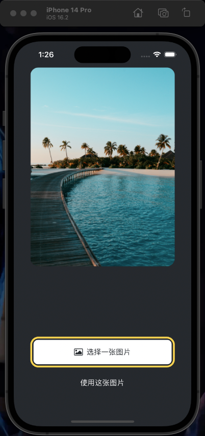

# StickerSmash - A React Native Photo Editing App

StickerSmash is a fun and interactive photo editing app built with React Native. It allows users to select an image from their device's photo library, add stickers and emojis, and save the edited image back to their photo library.



## Features

- **Image Selection**: Users can select an image from their device's photo library to start editing.
- **Sticker and Emoji Addition**: Users can add stickers and emojis to the selected image.
- **Image Saving**: Users can save the edited image to their device's photo library.

## Getting Started

To run the StickerSmash app, you'll need to have the following installed:

- [Node.js](https://nodejs.org/en/)
- [Expo CLI](https://docs.expo.io/get-started/installation/)
- [React Native](https://reactnative.dev/docs/environment-setup)

1. Clone the repository:

   ```
   git clone https://github.com/slince-zero/StickerSmash.git
   ```

2. Navigate to the project directory and install the dependencies:

   ```
   cd StickerSmash
   npm install
   ```

3. Start the Expo development server:

   ```
   expo start
   ```

4. Follow the instructions provided in the terminal to run the app on your device or emulator.

## Dependencies

The StickerSmash app uses the following dependencies:

- [React](https://reactjs.org/)
- [React Native](https://reactnative.dev/)
- [Expo](https://expo.io/)
- [react-native-gesture-handler](https://docs.swmansion.com/react-native-gesture-handler/)
- [react-native-view-shot](https://github.com/gre/react-native-view-shot)
- [expo-image-picker](https://docs.expo.io/versions/latest/sdk/imagepicker/)
- [expo-media-library](https://docs.expo.io/versions/latest/sdk/media-library/)

## Usage

1. **Select an Image**: Tap the "Select a Picture" button to open your device's photo library and choose an image to edit.
2. **Add Stickers and Emojis**: Tap the "Add Sticker" button to open the emoji picker, then select an emoji to add to the image.
3. **Save the Edited Image**: Tap the "Save" button to save the edited image to your device's photo library.

## Contributing

If you'd like to contribute to the StickerSmash project, please follow these steps:

1. Fork the repository.
2. Create a new branch for your feature or bug fix.
3. Make your changes and commit them.
4. Push your changes to your forked repository.
5. Submit a pull request to the original repository.

## License

This project is licensed under the [MIT License](LICENSE).